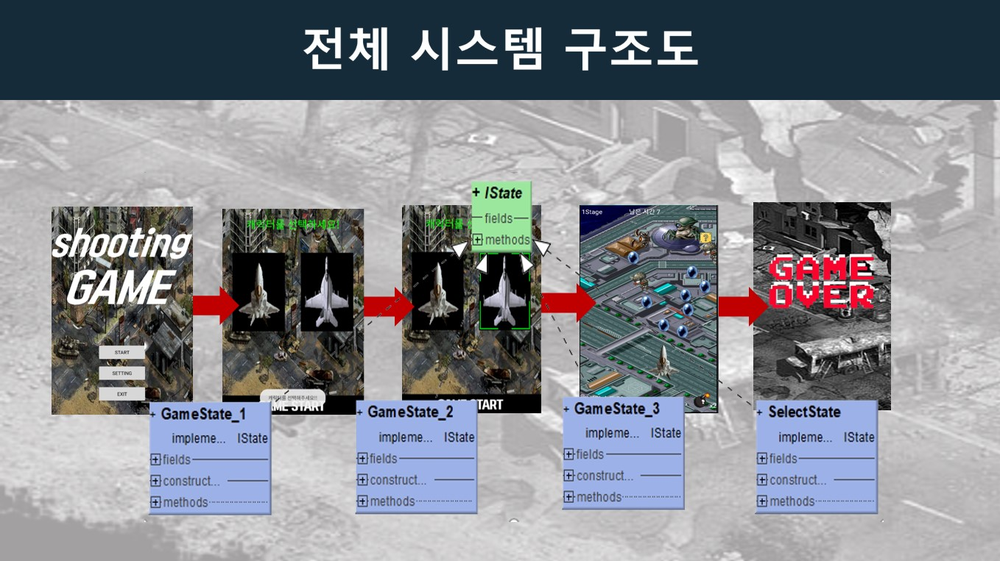
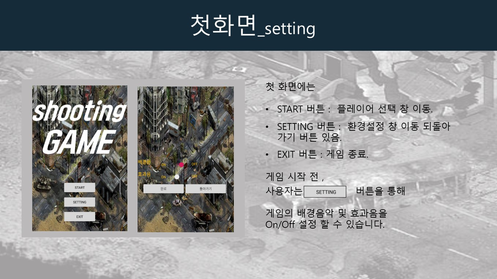
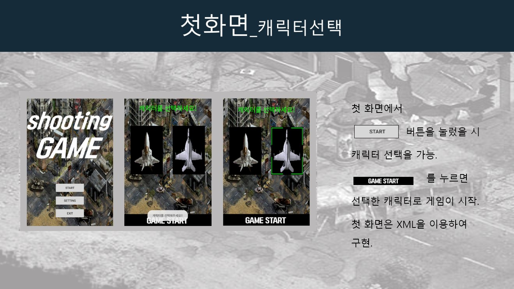
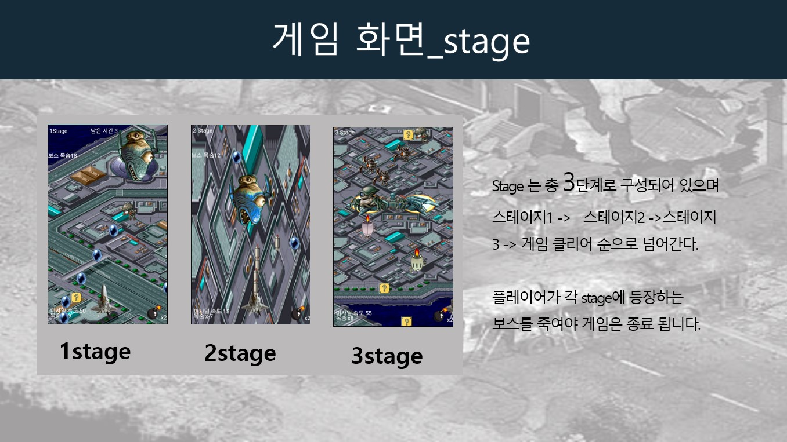
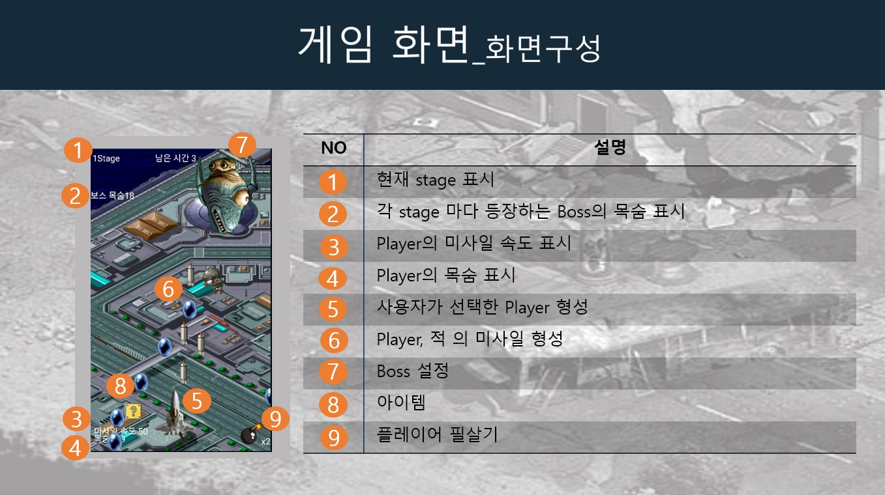
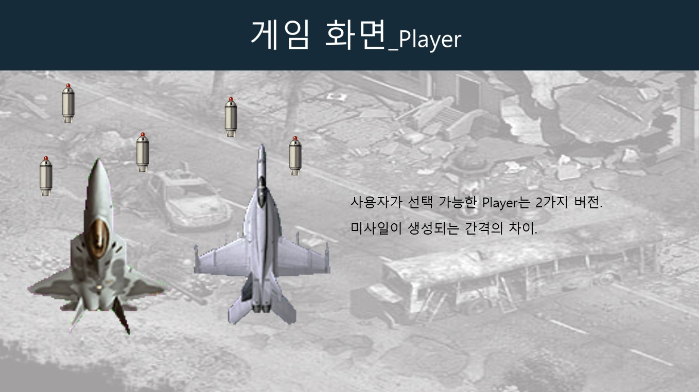
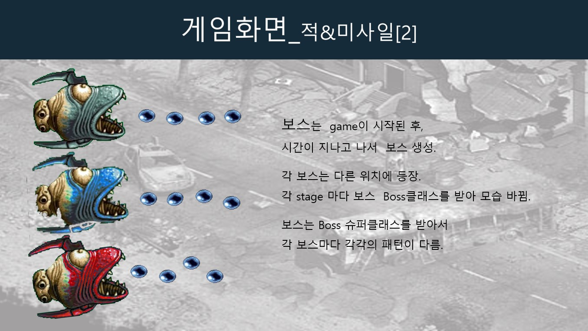
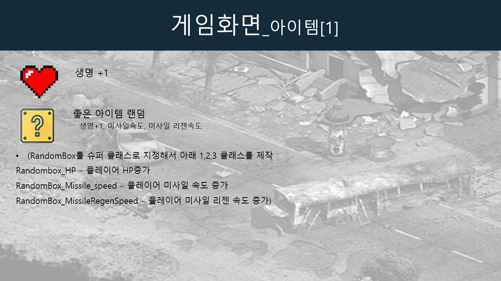
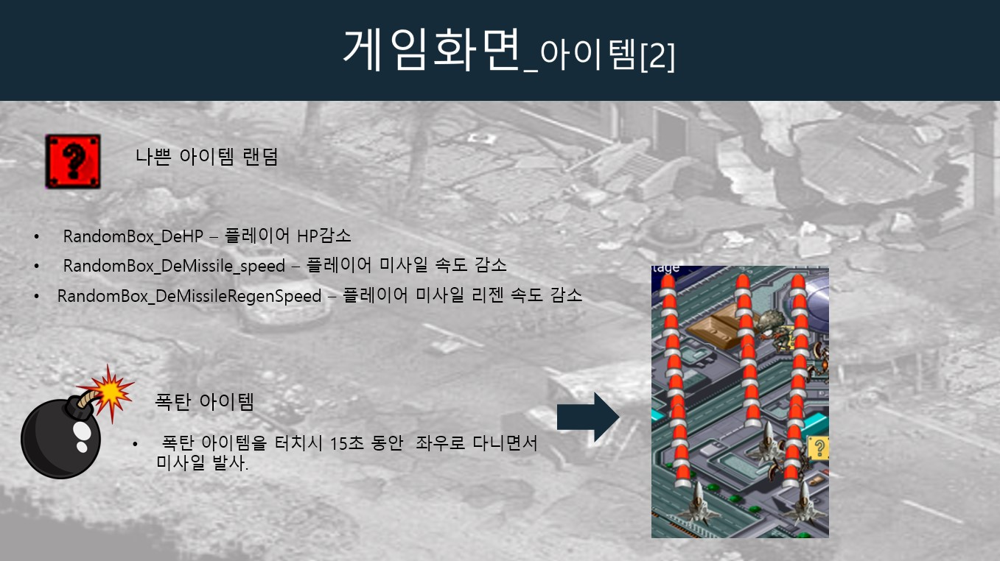
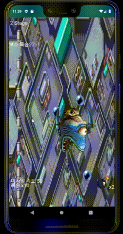

Java ShootingGame
===

안드로이드 슈팅게임

 

게임 구성
---

| 전체 시스템 구조도 |
|:----------------------------------------:|
||

| Setting 화면 |
|:----------------------------------------:|
||

| 플레이어 선택화면 |
|:----------------------------------------:|
||

| Stage 구성 |
|:----------------------------------------:|
||

| 게임 화면 구성 |
|:----------------------------------------:|
||

| Player 종류 |
|:----------------------------------------:|
||

| 적&미사일 |
|:----------------------------------------:|
||

| 보스 |
|:----------------------------------------:|
||

| 아이템1 |
|:----------------------------------------:|
||

| 아이템2&필살기 |
|:----------------------------------------:|
||

 

샘플 영상
---

| 플레이 영상 | 플레이 영상2 |
|:----------------------------------------:|:-----------------------------------------:|
|||
